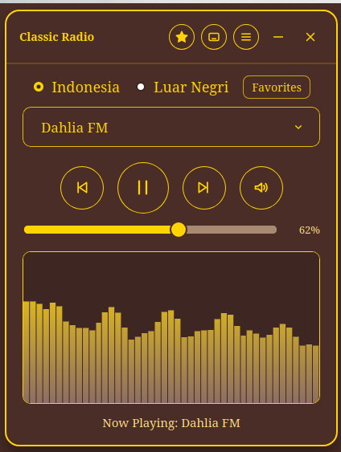
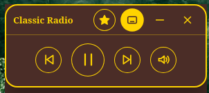
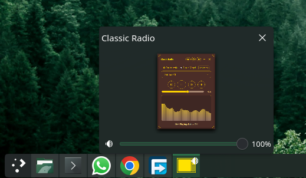
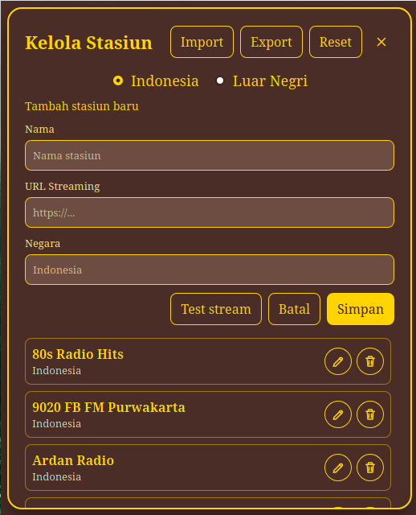

# Classic Radio

Classic Radio adalah aplikasi radio streaming desktop untuk Debian berbasis Tauri. UI klasik coklat keemasan dari versi web dipertahankan, lalu ditambah fitur desktop seperti system tray, manajemen stasiun, favorit, dan mini mode.

Package Debian juga menyertakan CLI opsional. Pengguna GUI tetap membuka aplikasi seperti biasa lewat launcher atau command `classic-radio`; versi terminal tersedia sebagai `classic-radio-cli`.

## Fitur

### GUI Desktop

- Streaming radio Indonesia dan internasional.
- Dukungan stream umum seperti MP3, AAC, OGG, dan HLS `.m3u8` lewat `hls.js` lokal.
- Visualizer audio berbasis canvas.
- Tambah, edit, hapus, reset, validasi URL, dan test stream stasiun.
- Import dan export daftar stasiun sebagai JSON.
- Favorite station dan filter khusus favorit.
- Mini mode untuk tampilan player ringkas.
- Penyimpanan preferensi user: source terakhir, stasiun terakhir, volume, mute, dan mini mode.
- Shortcut keyboard: Space untuk play/pause, Arrow Left/Right untuk previous/next, Arrow Up/Down untuk volume, Escape untuk menutup dropdown.
- Status playback lebih informatif untuk loading, buffering, offline, error stream, dan reconnect.
- Data perubahan stasiun disimpan lokal di aplikasi.
- Tombol close menyembunyikan window ke system tray.
- Tray menu: Show, Hide, Play/Pause, Previous, Next, Exit.
- Label Play/Pause dan tooltip tray mengikuti status player.
- Dependency frontend dibundel lokal, tanpa CDN runtime untuk icon dan HLS.
- CSP Tauri dibuat lebih ketat dibanding konfigurasi awal.
- Target build Debian package `.deb`.
- Versi aplikasi tampil di header GUI dan title bar CLI.

### Single Instance Lock

Hanya satu instance Classic Radio yang boleh berjalan, baik GUI maupun CLI. Mencoba membuka instance kedua akan ditolak dengan pesan jelas yang menyebut mode dan PID instance yang sudah berjalan, jadi audio tidak bertabrakan dan kontrol playback tetap konsisten. Lockfile disimpan di `$XDG_RUNTIME_DIR/classic-radio.lock` dan otomatis dibersihkan saat instance keluar (termasuk lockfile basi dari proses yang sudah mati).

### CLI Terminal

- Command terpisah: `classic-radio-cli`.
- Tidak menggantikan GUI dan tidak mengubah command `classic-radio`.
- Tampilan terminal interaktif dengan status now playing, volume, mute, source, dan paging stasiun.
- Browse daftar stasiun bawaan, search, dan filter berdasarkan source (Indonesia/International).
- Kontrol playback runtime lewat IPC ke `mpv`: pause/resume, mute, volume.
- Animasi audio meter saat streaming, indikator pause `‖` saat di-pause.
- UI berjalan di alternate screen buffer, jadi terminal kembali bersih saat keluar.
- Playback CLI memakai `mpv`, jadi install `mpv` jika ingin memakai CLI:

```bash
sudo apt install mpv
```

Daftar command di dalam CLI:

| Command | Aksi |
| --- | --- |
| `1`–`12` | Play stasiun di halaman ini |
| `>` / `next-page` | Halaman stasiun berikutnya |
| `<` / `prev-page` | Halaman stasiun sebelumnya |
| `/<kata>` | Cari stasiun |
| `all` | Tampilkan semua stasiun, reset filter |
| `src1` / `id` | Filter source Indonesia |
| `src2` / `intl` | Filter source International |
| `src` | Reset filter source |
| `p` / `pause` | Toggle pause/resume |
| `m` / `mute` | Toggle mute/unmute |
| `+` / `-` | Volume +/- 5 |
| `v <0-100>` | Set volume |
| `n` / `next` | Stasiun berikutnya, auto play |
| `b` / `prev` | Stasiun sebelumnya, auto play |
| `s` / `stop` | Hentikan playback |
| `i` / `info` | Refresh tampilan |
| `h` / `help` / `?` | Bantuan |
| `q` / `quit` | Keluar |

## Screenshot

### Full Mode



### Mini Mode



### Panel Preview



### Kelola Stasiun



## Struktur

```text
.
├── assets/
│   ├── full-mode.png
│   ├── mini-mode.png
│   ├── on-panel-preview.png
│   └── setting-window.png
├── package.json
├── vite.config.js
├── src/
│   ├── index.html
│   ├── main.js
│   ├── manager.html
│   ├── manager.js
│   ├── station-store.js
│   ├── station-store.test.js
│   ├── style.css
│   └── data/
│       ├── indonesia.js
│       └── international.js
├── src-tauri/
    ├── resources/
    │   └── stations.json
    ├── Cargo.toml
    ├── tauri.conf.json
    ├── build.rs
    └── src/
        ├── bin/
        │   └── classic-radio-cli.rs
        ├── lib.rs
        └── main.rs
└── docs/
    └── source_radio_indonesia/
```

## Prasyarat Debian

Install dependency native yang dibutuhkan Tauri/WebKitGTK:

```bash
sudo apt install pkg-config libglib2.0-dev libwebkit2gtk-4.1-dev libayatana-appindicator3-dev librsvg2-dev patchelf
```

## Development

Install dependency JavaScript:

```bash
npm install
```

Jalankan aplikasi desktop:

```bash
npm run tauri:dev
```

Jalankan CLI dari source:

```bash
npm run build:cli
./src-tauri/target/debug/classic-radio-cli
```

Jalankan test, build frontend, dan `cargo check`:

```bash
npm run check
```

Build paket Debian:

```bash
npm run deb
```

File `.deb` akan dibuat di:

```text
src-tauri/target/release/bundle/deb/
```

Untuk versi `0.3.1`, nama artefak yang dihasilkan:

```text
Classic Radio_0.3.1_amd64.deb
```

Setelah `.deb` di-install, command yang tersedia:

```bash
classic-radio      # GUI desktop
classic-radio-cli  # CLI terminal opsional
```

## Catatan Debian

System tray di Linux bergantung pada dukungan tray desktop environment yang dipakai. Pada beberapa environment minimal, paket AppIndicator/Ayatana mungkin perlu tersedia agar icon tray tampil.

## Catatan Data

Daftar stasiun custom dan preferensi user disimpan di storage lokal WebView aplikasi. Gunakan fitur import/export JSON di window Kelola Stasiun untuk backup atau migrasi daftar stasiun.
